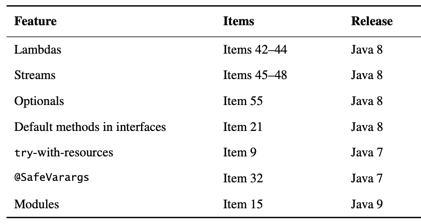

* "component"
  * == reusable software element / [individualMethod, complexFrameworkWithMultiplePackages]
  * allows
    * reusing code != copying code 
  * recommendations
    * MINIMUM dependencies BETWEEN components  
* Errors
  * should be detected | compile time 
* Java Language Specification's technical terms
  * supported types
    * reference types
      * interfaces (+ annotations)
      * classes (+ enums)
      * arrays
    * primitives
      * != objects
  * objects
    * == class instances + arrays
  * class’s members
    * == 's fields + methods + member classes + member interfaces
  * method’s signature
    * =='s name + formal parameters' types (== arguments' types)
      * NOT include method’s return type
* terms | this book / 
  * != Java Language Specification
    * inheritance
      * == subclassing
        * _Examples:_
          * "class -- implements an -- interface"
          * "one interface -- extends -- another interface"
    * if NO access level specified -> use traditional package-private
      * != correct package access [JLS, 6.6.1](https://docs.oracle.com/javase/specs/jls/se24/html/jls-6.html#jls-6.6.1)
  * NOT exist | Java Language Specification
    * exported API OR API
      * == classes, interfaces, constructors, members, and serialized forms / programmer -- accesses a -- class, interface, or package 
      * == API elements / accessible -- outside the -- package / defines the API
      * of a package
        * == ALL package's public class or interface's public protected members & constructors 
    * user of the API
      * == programmer / writes a program / uses an API
    * client of the API
      * == class / 's implementation -- uses an -- API 
    * API elements
      * == Classes + interfaces + constructors + members + serialized forms
